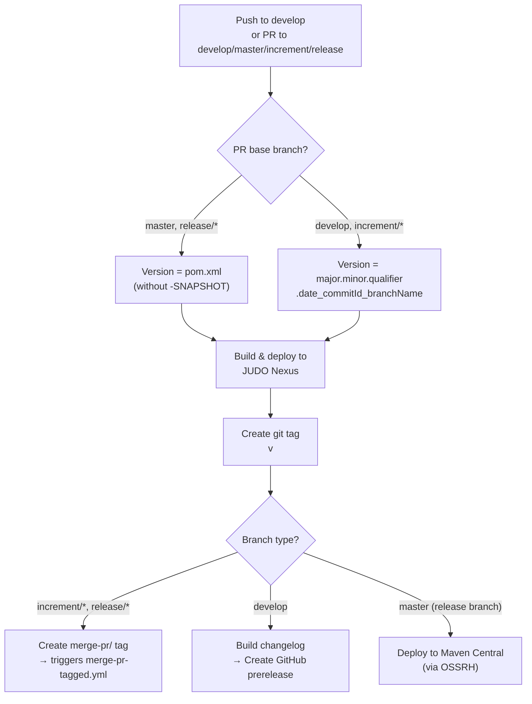
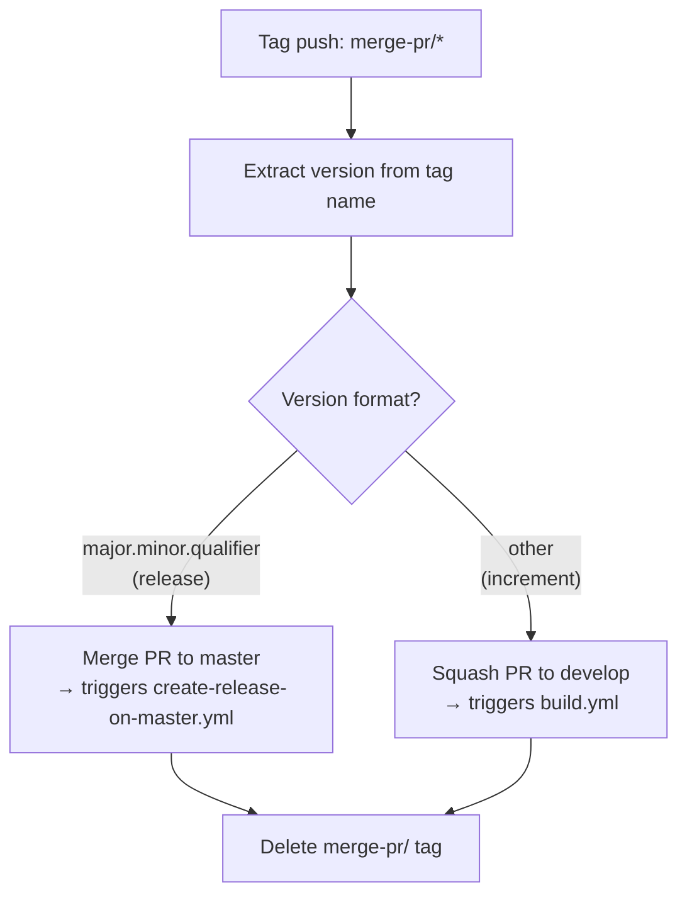
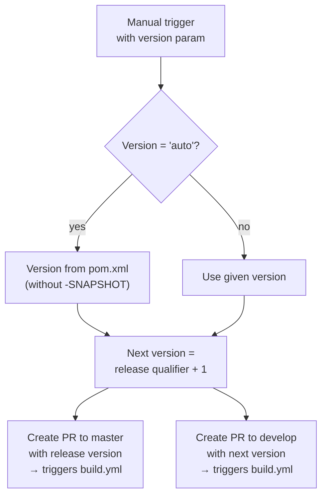

# Development Version and Branch Handling

This document describes the branching strategy, versioning policy, and CI/CD pipeline for this JUDO module.

## Branches

The versioning policy follows [GitFlow](https://www.atlassian.com/git/tutorials/comparing-workflows/gitflow-workflow):

| Branch Pattern | Purpose |
|---|---|
| `develop` | Main development branch — latest sources of the active version |
| `feature/JNG-NUMBER_short_summary` | Feature branches based on `develop` for new functionality |
| `release/X.Y.Z` or `X_Y_betaN` | Release branches for stabilization and testing |
| `bugfix/JNG-NUMBER_short_summary` | Bug fixes based on release branches, must be applied to newer versions too |
| `support/JNG-NUMBER_short_summary` | Support branches based on release branches for minor changes |
| `master` | Latest released sources of the active version |

```mermaid
gitGraph
    commit id: "init"
    branch develop
    checkout develop
    commit id: "dev-1"
    branch feature/JNG-1
    commit id: "feat-1"
    commit id: "feat-2"
    checkout develop
    merge feature/JNG-1 id: "merge-feat"
    commit id: "dev-2"
    branch release/1.0-beta1
    commit id: "rc-1"
    branch bugfix/JNG-4
    commit id: "fix-1"
    checkout release/1.0-beta1
    merge bugfix/JNG-4 id: "merge-fix"
    checkout develop
    merge release/1.0-beta1 id: "merge-release"
    checkout master
    merge release/1.0-beta1 id: "release-1.0" tag: "v1.0"
```

## Version Numbers

Versions follow semantic versioning with these rules:

| Scenario | Version Change |
|---|---|
| Starting a feature branch | No version change |
| Starting a release branch | 2nd number incremented on `develop` |
| Bugfix branches | No version change (applied to release branch before merge to master) |
| Support branches | 3rd number incremented (minor changes on previous release) |
| Hotfix branches | 3rd number incremented (applied to both release and master) |

## GitHub Actions CI/CD Pipeline

### build.yml — Main Build Pipeline

Triggers on pushes to `develop` and pull requests to `develop`, `master`, `increment/*`, and `release/*` branches.



### merge-pr-tagged.yml — PR Auto-Merge

Triggered when a `merge-pr/*` tag is pushed (by `build.yml` after successful build).



### create-release-on-master.yml — Release Creation

Triggered on push to `master`. Builds a changelog and creates a GitHub release (marked as latest).

### release.yml — Manual Release Trigger

Manually triggered with a version parameter (`auto` or a specific `major.minor.qualifier`).



## Development Rules

> **Important:** There is no commit without a ticket number. All pull requests and commits must include a `JNG-xxx` reference.

For issue tracking, use [JIRA](https://blackbelt.atlassian.net/jira/dashboards).
