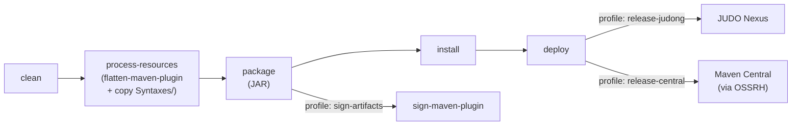

# JSL TextMate Bundle

Syntax highlighting for the **JUDO Specific Language (JSL)** in all TextMate-compatible editors, including VS Code, JetBrains IDEs, Sublime Text, and others.

## What is JSL?

JSL is the domain-specific language used by the [JUDO platform](https://github.com/BlackBeltTechnology) to define data models, transfer objects, UI views, and actor-based access control. This bundle provides grammar-based syntax highlighting so `.jsl` files render with proper coloring in your editor.

## Highlighted Language Constructs

The grammar recognizes the following JSL elements:

| Category | Keywords / Constructs |
|---|---|
| **Top-level blocks** | `model`, `entity`, `transfer`, `view`, `row`, `actor`, `enum`, `query`, `error` |
| **Members** | `field`, `relation`, `identifier`, `event`, `action`, `link`, `table`, `group`, `menu`, `item`, `column`, `text` |
| **Modifiers** | `required`, `abstract`, `extends`, `maps`, `static`, `throws` |
| **Lifecycle hooks** | `on`, `instead`, `before`, `after`, `guard`, `claim` |
| **Built-in types** | `Boolean`, `Date`, `Numeric`, `String`, `Timestamp`, `Time`, `Binary`, `Enumeration` |
| **Other** | Annotations (`@Name`), lambda expressions (`=>`), comments (`//`, `/* */`) |

## Project Structure

```
judo-jsl-tmbundle/
├── Syntaxes/
│   └── jsl.tmLanguage      ← Core grammar definition (XML plist)
├── info.plist               ← TextMate bundle metadata
├── pom.xml                  ← Maven build (packages grammar into JAR)
├── doc/
│   └── install-idea.md      ← JetBrains IDE installation guide
└── .github/workflows/       ← CI/CD pipeline definitions
```

## Grammar Architecture

The TextMate grammar is organized into nested pattern repositories. Each top-level JSL construct has its own block pattern that delegates to shared sub-patterns for members, types, and expressions.

```mermaid
graph TD
    root["#code (root)"] --> entity["#entity-block"]
    root --> transfer["#transfer-block"]
    root --> view["#view-block"]
    root --> row["#row-block"]
    root --> actor["#actor-block"]
    root --> enum["#enum-block"]
    root --> model["#model"]
    root --> import["#import"]
    root --> annotations["#annotations"]
    root --> comments["#comments"]
    root --> keywords["#keywords"]
    root --> types["#types"]

    entity --> field["#field-member"]
    entity --> relation["#relation-member"]
    entity --> identifier["#identifier-member"]
    entity --> constraint["#constraint-member"]
    entity --> event["#event-member"]

    transfer --> action["#action-member"]
    transfer --> link["#link-member"]
    transfer --> event2["#event-member"]

    view --> table["#table-member"]
    view --> group["#group-member"]
    view --> link2["#link-member"]

    actor --> menu["#menu-member"]
    actor --> access["#access-member"]
    actor --> claim2["#claim-member"]
```



## Build

The project uses Maven to package the grammar into a JAR artifact (published to Nexus / Maven Central), making it available as a dependency for other JUDO tooling.

```bash
# Build and package
./mvnw clean install

# Build with a specific version
./mvnw -Drevision=1.2.3 clean install
```

> **Note:** There is no Java source code in this project. The Maven build simply copies `Syntaxes/jsl.tmLanguage` into `target/classes/syntaxes/` and packages it as a JAR.

## Installation

- **VS Code:** Place the bundle in your VS Code extensions directory, or install from a `.vsix` package.
- **JetBrains IDEs (IntelliJ, WebStorm, etc.):** See [JetBrains installation guide](doc/install-idea.md).
- **Sublime Text / Other TextMate editors:** Copy the bundle directory to the appropriate packages location.

## Build Lifecycle



## Related

- [Contributing Guide](CONTRIBUTING.md)
- [CI/CD Flow Documentation](.github/CIFLOW.md)
- [JUDO Community](https://github.com/BlackBeltTechnology/judo-community)
